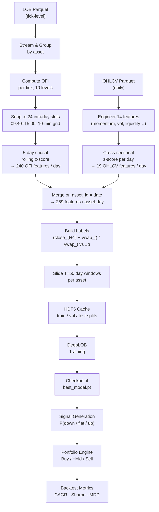
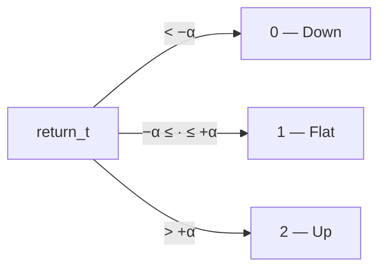
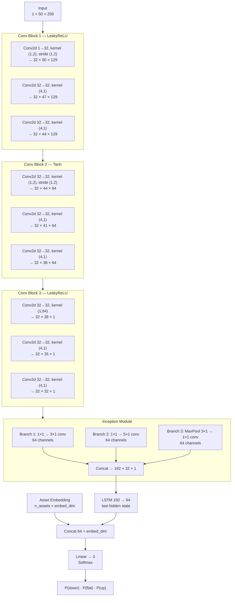
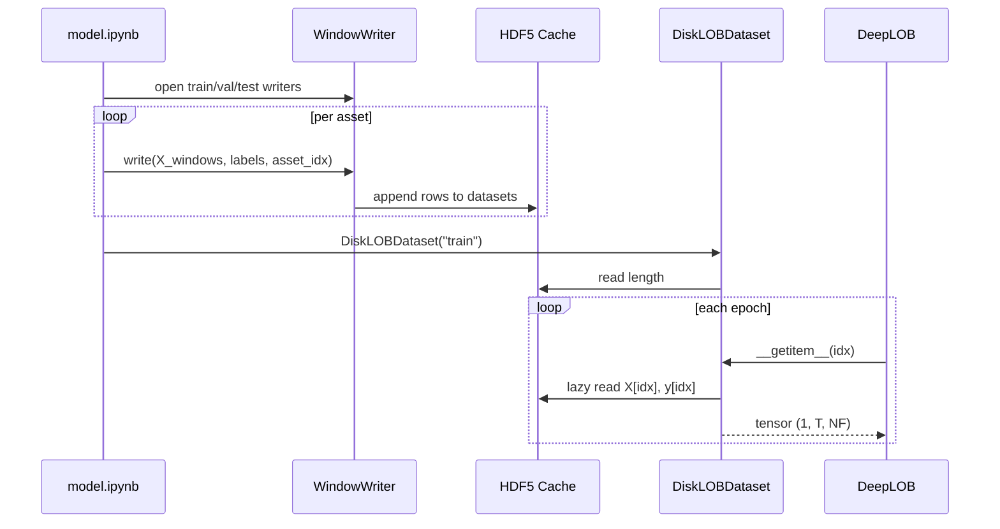
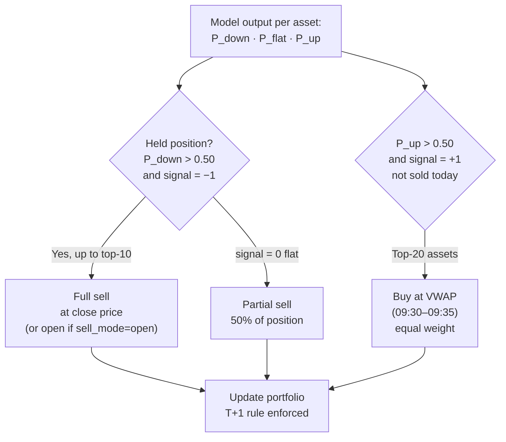
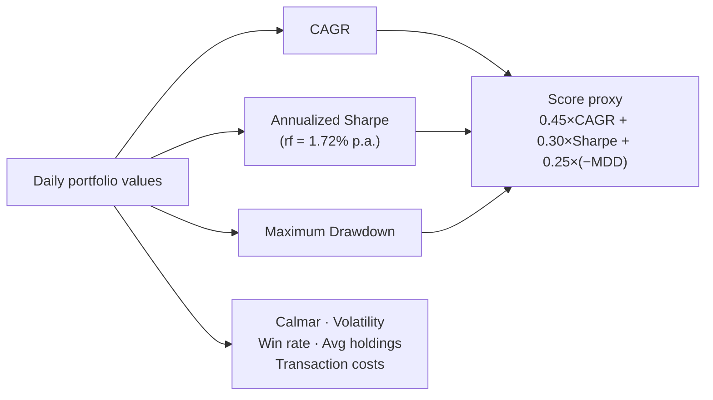

# Shifu — DeepLOB for Chinese Equities

A research pipeline that applies DeepLOB (deep convolutional neural networks for limit order books) to Chinese A-share stocks. The model ingests 50 days of intraday order-flow and daily price history per asset, predicts tomorrow's return direction, and drives a rule-based long/short portfolio backtested on held-out data.

---

## Table of Contents

1. [Setup](#setup)
2. [Data](#data)
3. [End-to-End Pipeline](#end-to-end-pipeline)
4. [Feature Engineering](#feature-engineering)
5. [Labelling](#labelling)
6. [Model Architecture](#model-architecture)
7. [Training](#training)
8. [Portfolio Management](#portfolio-management)

---

## Setup

**Prerequisites:** Python ≥ 3.10, [uv](https://github.com/astral-sh/uv).

```bash
# 1. Install all dependencies (creates / reuses .venv automatically)
uv sync

# 2. Pull the data from the Cloudflare R2 remote
#    Credentials are stored in .dvc/config.local — contact the team for access
uv run dvc pull

# 3. Open JupyterLab and run notebooks in order
uv run jupyter lab
```

Linting is handled by **ruff** (`line-length = 100`). Run `uv run ruff check .` before committing.

---

## Data

Two parquet files are versioned with DVC (remote: Cloudflare R2 bucket `feishu`, ~2.2 GB total):

| File | Description |
|---|---|
| `data/lob_data_in_sample.parquet` | Tick-level LOB snapshots — 10 bid/ask price+volume levels per tick, timestamped |
| `data/daily_data_in_sample.parquet` | Daily OHLCV per asset, including `vwap_0930_0935` (the day-open execution reference price) |

The LOB file is streamed in 500 k-row batches rather than loaded into memory at once.

---

## End-to-End Pipeline



---

## Feature Engineering

### OFI Features (240)

Order-flow imbalance (OFI) measures the net pressure exerted by market participants at each price level of the order book. At each LOB level *i*, OFI is computed tick-by-tick as the change in bid-side depth minus the change in ask-side depth, where the sign convention accounts for whether the best price moved up, stayed, or moved down.

The pipeline:
1. Computes OFI for all 10 levels on every tick within a trading day.
2. Maps each tick to one of **24 fixed intraday time slots** (09:40, 09:50, …, 11:20, then 13:00–15:00 at 10-minute intervals). Off-grid ticks are discarded; missing slots are zero-filled.
3. Produces a `(24 slots × 10 levels) = 240`-dimensional daily vector, ordered slot-major.
4. Applies a **causal 5-day rolling z-score** per feature (using only past days, never the current or future), so no look-ahead leakage is introduced.

### OHLCV Features (19)

14 engineered features are computed per-asset, then all 19 (including the 5 raw prices) are **cross-sectionally z-scored per trading day** — meaning each feature is standardized across all assets on the same day, removing market-wide level effects.

| Group | Features |
|---|---|
| Momentum | `ret_1d`, `ret_5d`, `ret_10d`, `ret_20d` |
| Realized volatility | `vol_5d`, `vol_20d` (rolling std of log-returns) |
| Liquidity | `amihud` (|return| / value traded), `volume_zscore` (20-day rolling) |
| Momentum oscillator | `rsi_14` |
| Price structure | `ma_dist_5`, `ma_dist_20` (distance from moving averages), `open_close_ret`, `high_low_range`, `close_vwap_dist` |
| Raw prices | `open`, `close`, `volume`, `low`, `high` |

The final input to the model is a **259-feature vector** per (asset, day): 240 OFI + 19 OHLCV, concatenated in that order. All values are clipped to [−5, 5] before being stored.

---

## Labelling

The prediction target is the forward return from entering a position at the day-*t* VWAP (09:30–09:35 average) and exiting at the day-*(t+1)* close:

```
return_t = (close_{t+1} − vwap_t) / |vwap_t|
```

This return is discretized into three classes using a symmetric threshold **α**:



Two checkpoints use different alpha values:

| Version | α | Description |
|---|---|---|
| v2 | 0.015 (1.5%) | Wider threshold, fewer signal days |
| v3 | 0.002 (0.2%) | Tighter threshold, used in production backtest |

The train/val/test split is **per-asset chronological**: 70% train → 85% cumulative val → last 15% test. No asset ever leaks future data into training.

---

## Model Architecture

DeepLOB treats each sample as a single-channel 2D image of shape `(1, T=50, NF=259)` — 50 trading days on the time axis and 259 features on the spatial axis. Three convolutional blocks progressively collapse the spatial dimension to 1, an Inception module captures multi-scale temporal patterns, and an LSTM reads the resulting sequence. An asset embedding is concatenated before the classification head to give the model per-stock context.



### Key design choices

- **Spatial dimension = features, not price levels.** Unlike the original DeepLOB paper (which operates on raw bid/ask columns), this implementation treats the full 259-feature vector as the spatial axis, letting convolutions learn cross-feature interactions.
- **Stride-2 convolutions halve the spatial dimension.** Block 1 takes 259 → 129; block 2 takes 129 → 64; block 3 collapses the remaining 64 to 1 with a `(1, 64)` kernel. This avoids pooling and keeps gradient flow clean.
- **Inception branches capture short, medium, and pooled temporal context** at the 1-wide spatial stage (kernel heights 3, 5, and MaxPool-3).
- **Asset embedding** (with `max_norm=1.0`) is injected after the LSTM, giving the model a learnable, norm-bounded per-stock bias without contaminating the convolutional feature extraction.
- **BatchNorm after every conv** stabilizes training across the varied scale of OFI and OHLCV features.

---

## Training

| Hyperparameter | Value |
|---|---|
| Lookback window T | 50 trading days |
| Batch size | 64 |
| Optimizer | Adam, lr = 1e-4 |
| Loss | CrossEntropyLoss |
| Epochs | 10 |
| Checkpoint frequency | every 5 epochs + best val-loss |

### Data pipeline for training

Because the full sliding-window dataset (millions of `50 × 259` float32 arrays) does not fit in RAM, it is written once to an **HDF5 cache** (`cache/daily_windows/{train,val,test}.h5`) using an append-mode writer. At training time `DiskLOBDataset` opens the HDF5 file lazily per DataLoader worker, reading individual samples on demand. This keeps the peak RAM footprint proportional to a single batch, not the entire dataset.



The best checkpoint (lowest validation loss) is saved as `best_model.pt`; full optimizer state is saved every 5 epochs for resumability.

---

## Portfolio Management

`notebooks/portfolio_management.ipynb` backtests the trained model strictly on the **test split** (the last 15% of trading days seen by no training epoch).

### Signal generation

For each test day *t*, the model receives the `(n_valid_assets, 1, T, NF)` feature tensor covering the window `[t−T+1, t]` and outputs a probability triplet `[P(down), P(flat), P(up)]` for every asset. Assets without a complete T-day history are excluded on that day.

### Decision rules



**Order of operations each day:**
1. **Sell first.** Full sells (strong down signal, top-10 by P(down)) are executed before buys, freeing capital. Partial sells (flat signal, 50% of position) follow.
2. **Buy second.** Top-20 assets by P(up) that weren't sold today and have P(up) > 0.50 receive equal allocations from the available cash, holding back a 5% cash buffer.
3. **T+1 lock.** Shares bought on day *t* are locked and cannot be sold until day *t+1*, simulating the Chinese A-share settlement rule.

### Execution and costs

| Parameter | Value |
|---|---|
| Initial capital | RMB 50,000,000 |
| Lot size | 100 shares |
| Commission (buy & sell) | 0.01% (min RMB 5) |
| Stamp duty (sell only) | 0.05% |
| Minimum holdings constraint | 10 positions at all times |
| Entry price | VWAP (09:30–09:35) |
| Exit price | Close (or Open if `sell_mode=open`) |

### Performance metrics



The notebook also writes a trade log to `submissions/` in CSV format (`trade_day_id`, `asset_id`, `buy_percentage`, `sell_percentage`) and validates it against the competition submission rules before saving.

---
